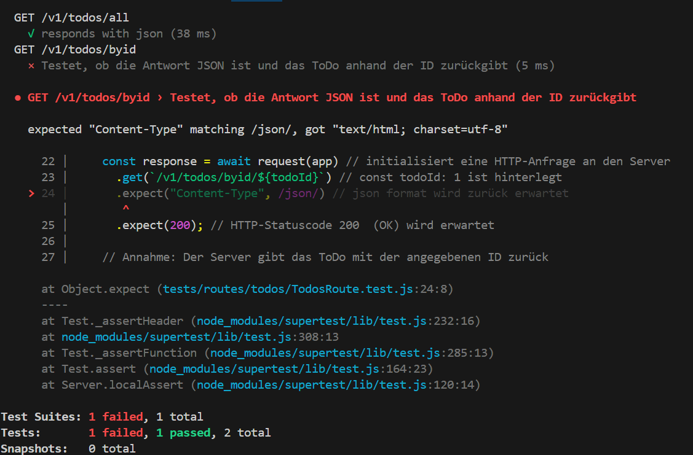

# Aufgabe 2: Trial & Error
Abgabe Link zu der Datei TodosRoute.test.js in eurem Repo
Vorab möchte ich zu dieser Aufgabe sagen, dass ihr keine perfekte Lösung vorweisen müsst, ich möchte trotzdem, dass ihr einen Ansatz versucht zu entwickeln.

Basierend auf unserem ersten Testfall in der Datei ./tests/routes/todos/TodosRoute.test.js sollt ihr probieren einen weiteren Testfall zu /byid hinzuzufügen. Also den existierenden Testfall kopieren und dann versuchen die richtigen informationen in den neuen Testfall einzutragen. Kein Problem, wenn ihr das nicht gelöst bekommt, probiert es aber einfach mal aus. Der Test muss auch nicht ohne Fehler durchlaufen :) 


### Wie erwartet Fehler weil keine Testdaten in der Datenbank ```todo_app_test``` vorhanden sind


